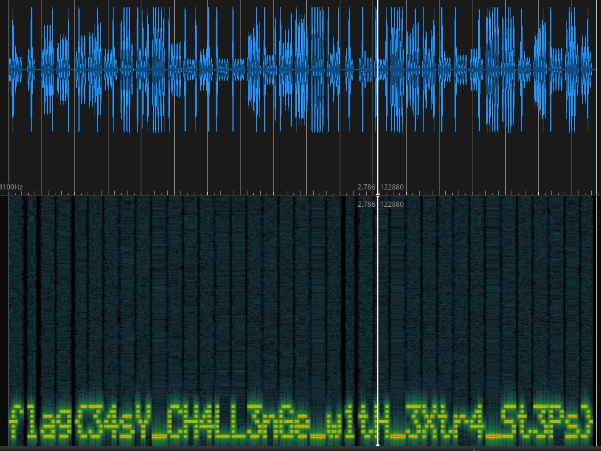

# 3in1
## Description

Like Nescafeeeee!

## Attachments

https://ctf.k3rn3l4rmy.com/kernelctf-distribution-challs/nescafeee/AES.py

### Todos
To decrypt the string in the given AES.py script (String is in scriptfile as a comment), I'll use the `attempt.py` script. Based on the given one. 

```text
b'https://www.mediafire.com/file/oii1sm3oyt4tyjc/flag.wav/file\nhttps://www.mediafire.com/file/rgdww91os3we7eo/hint.txt/file{{{{{{{'
```

Okay no flag, but some extra files. Lets take a look into them and `wget` them down.

The downloaded file `hint.txt` let me take a look with `sonic-visualiser` so i opened the flag.wav with sonic and added a spectogram.

```shell
cat hint.txt
A graphic or photographic representation
```

After adding the spectogram to the wav file, we see this and can solve this thing :)


> flag{34sY_CH4LL3nGe_w1tH_3Xtr4_St3Ps}